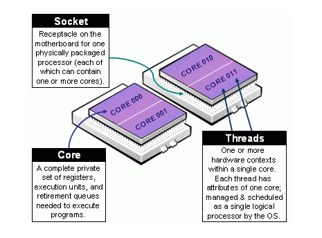

# Scheduling jobs

In these sections, you will learn:

 -  What is a scheduler and why are they used?
 -  How do I launch a program to run on any one node in the cluster?
 -  How do I capture the output of a program that is run on a node in the cluster?

We will walk through the steps to run a simple "Hello World" style program on 
a general cluster. This includes:

 -  Submitting the Hello World script
 -  Using the batch system command line tools to monitor the execution of your job.
 -  Inspecting the output and error files of the jobs.


## What is a job scheduler?

An HPC system might have thousands of nodes and thousands of users. How do we decide who gets what and when? How do we ensure that a task is run with the resources it needs? This job is handled by a special piece of software called the scheduler. On an HPC system, the scheduler manages which jobs run where and when. Contention between users and resources (job run time, CPUs, RAM, nodes) is managed by the job scheduler using the [Fairshare](https://slurm.schedmd.com/fair_tree.html#enduser) algorithm.

The scheduler used in this lesson is [SLURM](https://slurm.schedmd.com/). Although SLURM is not used everywhere, running jobs is quite similar regardless of what software is being used. The exact syntax might change, but the concepts remain the same.


## Running a batch job

The most basic use of the scheduler is to run a command non-interactively. Any command (or series of commands) that you want to run on the cluster is called a *job*, and the process of using a scheduler to run the job is called *batch job submission*. In this case, the job we want to run is just a shell script. Let’s create a demo shell script to run as a test.


## Creating our test job

Using your favorite text editor, create the following script and run it. Does it run on the cluster or just our login node?

```bash
#!/bin/bash

echo 'This script is running on:'
hostname
sleep 120
```

I could easily run my script on a login node (the process will sleep for 120 seconds, or two minutes)

```bash
$ chmod +x example-job.sh
$ ./example-job.sh
```

But you probably realize that there is a distinction between just "running it" as we did above, and running the job through the scheduler. To submit this job to the scheduler, we use the sbatch command.

```bash
[remote]$ sbatch example-job.sh       
Submitted batch job 36855
```

And that’s all we need to do to submit a job. Our work is done – now the scheduler takes over and tries to run the job for us. While the job is waiting to run, it goes into a list of jobs called the *queue*. To check on our job’s status, we check the queue using the command squeue.

```bash
[remote]$ squeue -u yourUsername
```
```bash
JOBID USER         ACCOUNT     NAME           ST REASON START_TIME         TIME TIME_LEFT NODES CPUS
36856 yourUsername yourAccount example-job.sh R  None   2017-07-01T16:47:02 0:11 59:49     1     1
```

We can see all the details of our job, most importantly that it is in the “R” or “RUNNING” state. Sometimes our jobs might need to wait in a queue (“PENDING”) or have an error. The best way to check our job’s status is with squeue. Of course, running squeue repeatedly to check on things can be a little tiresome. To see a real-time view of our jobs, we can use the watch command. watch reruns a given command at 2-second intervals. Let’s try using it to monitor another job. You can get a rough estimate of when your job will start with squeue --start. This estimate is dynamic since as soon as more jobs are submitted by other users or when jobs end, the estimate start time will increase or decrease. Also, remember on a large cluster thousands or even tens of thousands of jobs are started/ended per minute.

```bash
[remote]$ sbatch example-job.sh
[remote]$ watch squeue -u yourUsername
[remote]$ squeue --start -j <JobID>
```

 You should see an auto-updating display of your job’s status. When it finishes, it will disappear from the queue. Press Ctrl-C when you want to stop the watch command.

## Customizing the job

The job we just ran used all of the scheduler’s default options. In a real-world scenario, that’s probably not what we want. The default options represent a reasonable minimum. Chances are, we will need more cores, more memory, more time, among other special considerations. To get access to these resources we must customize our job script.

Comments in UNIX (denoted by #) are typically ignored. But there are exceptions. For instance the special #! comment at the beginning of scripts specifies what program should be used to run it (typically /bin/bash). Schedulers like SLURM also have a special comment used to denote special scheduler-specific options. Though these comments differ from scheduler to scheduler, SLURM’s special comment is #SBATCH. Anything following the #SBATCH comment is interpreted as an instruction to the scheduler.

Let’s illustrate this by example. By default, a job’s name is the name of the script, but the -J option can be used to change the name of a job.

Let's modify our job script to add a job name:

```bash
#!/bin/bash
#SBATCH -J new_name

echo 'This script is running on:'
hostname
sleep 120
```

And submit:

```bash
[remote]$ sbatch example-job.sh
```

And now use squeue to look at it:

```bash
[remote]$ squeue -u yourUsername
JOBID USER         ACCOUNT     NAME     ST REASON   START_TIME TIME TIME_LEFT NODES CPUS
38191 yourUsername yourAccount new_name PD Priority N/A        0:00 1:00:00   1     1
```

Fantastic, we’ve successfully changed the name of our job!


## Setting up email notifications

Jobs on an HPC system might run for days or even weeks. We probably have better things to do than constantly check on the status of our job with squeue.  We can easily set up our test job to send you an email when it finishes:

```
# mail alert at start, end and abortion of execution
#SBATCH --mail-type=ALL

# send mail to this address
#SBATCH --mail-user=avocado.john@gmail.com
```

Take a look at the [online documentation for sbatch](https://slurm.schedmd.com/sbatch.html) for
more email options


## Resource requests

But what about more important changes, such as the number of CPUs and memory for our jobs? One thing that is absolutely critical when working on an HPC system is specifying the resources required to run a job. This allows the scheduler to find the right time and place to schedule our job. If you do not specify requirements (such as the amount of time you need), you will likely be stuck with your site’s default resources, which is probably not what we want.

The following are several key resource requests:


 * -N <nnodes> - how many nodes does your job need? (note here about multpiple node wastes...)
 * -c <ncpus> - How many CPUs does your job need?
 * --mem=<megabytes> - How much memory on a node does your job need in megabytes? You can also specify gigabytes using by adding a little “g” afterwards (example: --mem=5g)
 * --time <days-hours:minutes:seconds> - How much real-world time (wall time) will your job take to run? The <days> part can be omitted.

Note that just *requesting* these resources does not make your job run faster! You generally
want to ask for the minimum amount so that your jobs run faster. Learn more in our [best practices](/docs/tutorials/using-resources-effectively/part-1) tutorial.

## Job environment variables

When SLURM runs a job, it sets a number of [environment variables](https://slurm.schedmd.com/sbatch.html#lbAI) for the job. For example, the SLURM_CPUS_PER_TASK variable is set to the number of CPUs you might request with -c. You can do simple things like echoing these variables during the runtime of your job to debug that what you are asking for is what you are getting. In this case, we can print how many CPUs have been allocated.

```bash
#!/bin/bash
#SBATCH -J new_name

echo 'This script is running on:'
hostname
echo "The number of CPUs allocated is $SLURM_CPUS_PER_TASK"
sleep 120
```

What do we actually get when we are allocated an entire CPU?



Resource requests are typically binding. If you exceed them, your job will be killed. Let’s use wall time as an example. We will request 30 seconds of wall time, and attempt to run a job for two minutes.

```bash
#!/bin/bash
#SBATCH -t 0:0:30

echo 'This script is running on:'
hostname
sleep 120
```

Submit the job and wait for it to finish. Once it is has finished, check the log file.

```bash
[remote]$ sbatch example-job.sh
[remote]$ watch squeue -u yourUsername
[remote]$ cat slurm-38193.out
```
```bash
This job is running on:
gra533
slurmstepd: error: *** JOB 38193 ON gra533 CANCELLED AT 2017-07-02T16:35:48 DUE TO TIME LIMIT ***
```

Our job was killed for exceeding the amount of resources it requested. Although this appears harsh, this is actually a feature. Strict adherence to resource requests allows the scheduler to find the best possible place for your jobs. Even more importantly, it ensures that another user cannot use more resources than they’ve been given. If another user messes up and accidentally attempts to use all of the CPUs or memory on a node, SLURM will either restrain their job to the requested resources or kill the job outright. Other jobs on the node will be unaffected. This means that one user cannot mess up the experience of others, the only jobs affected by a mistake in scheduling will be their own.

## Canceling a job

Sometimes we’ll make a mistake and need to cancel a job. This can be done with the scancel command. Let’s submit a job and then cancel it using its job number.

```bash
[remote]$ sbatch example-job.sh
[remote]$ squeue -u yourUsername
```

Now cancel the job with it’s job number. Absence of any job info indicates that the job has been successfully cancelled.

```bash
[remote]$ scancel 38759
[remote]$ squeue -u yourUsername
JOBID USER ACCOUNT NAME ST REASON START_TIME TIME TIME_LEFT NODES CPUS
```

## Canceling multiple jobs

We can also all of our jobs at once using the -u option. This will delete all jobs for a specific user (in this case us). Note that you can only delete your own jobs.

```bash
[remote]$ scancel -u yourUsername
```

## Other types of jobs

Up to this point, we’ve focused on running jobs in batch mode. SLURM also provides the ability to run tasks as a one-off or start an interactive session.

There are very frequently tasks that need to be done semi-interactively. Creating an entire job script might be overkill, but the amount of resources required is too much for a login node to handle. A good example of this might be building a genome index for alignment with a tool like [HISAT2](https://ccb.jhu.edu/software/hisat2/index.shtml). Fortunately, we can run these types of tasks as a one-off with srun.

srun runs a single command on the cluster and then exits. Let’s demonstrate this by running the hostname command with srun. (We can cancel an srun job with Ctrl-c.)

```bash
[remote]$ srun hostname
gra752
```

srun accepts all of the same options as sbatch. However, instead of specifying these in a script, these options are specified on the command-line when starting a job. To submit a job that uses 2 CPUs for instance, we could use the following command:

```bash
[remote]$ srun -c 2 echo "This job will use 2 CPUs."
```

This job will use 2 CPUs. Typically, the resulting shell environment will be the same as that for sbatch.

### Interactive jobs



Sometimes, you will need a lot of resource for interactive use. Perhaps it’s our first time running an analysis or we are attempting to debug something that went wrong with a previous job. Fortunately, SLURM makes it easy to start an interactive job with srun:

```bash
[remote]$ srun --pty bash
```

You should be presented with a bash prompt. Note that the prompt will likely change to reflect your new location, in this case the worker node we are logged on. You can also verify this with hostname.

## Optional: Creating remote graphics

To demonstrate what happens when you create a graphics window on the remote node, use the xeyes command. A relatively adorable pair of eyes should pop up (press Ctrl-c to stop).

This command requires you to have connected with X-forwarding enabled (`ssh -X username@host.address.ca`). 
If you are using a Mac, you must have installed XQuartz (and restarted your computer) for this to work.
When you are done with the interactive job, type exit to quit your session.

>  ## Key Points
>  *  The scheduler handles how compute resources are shared between users.
>  *  Everything you do should be run through the scheduler.
>  *  A job is just a shell script.
>  *  If in doubt, request more resources than you will need.
